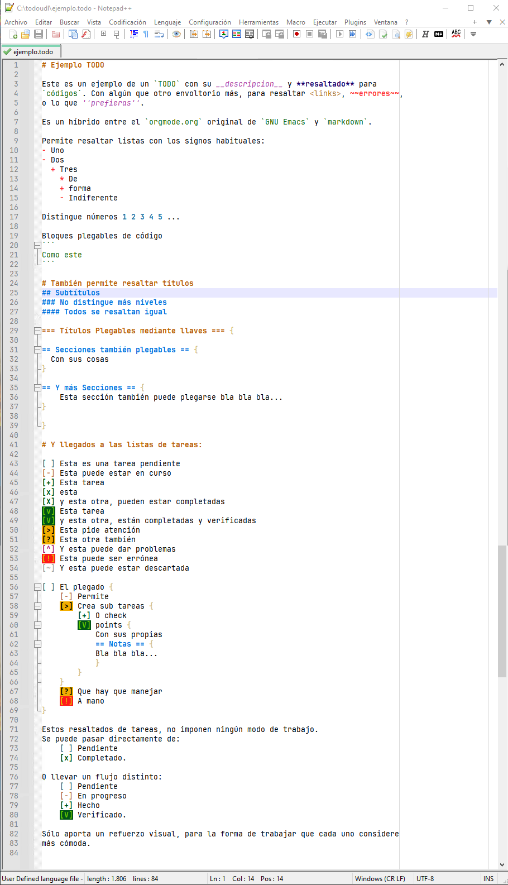
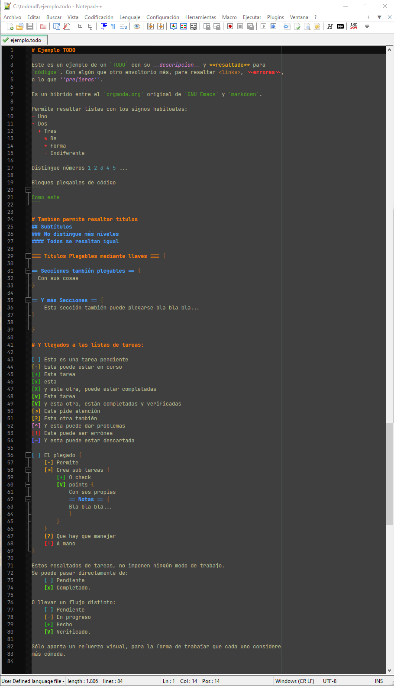

# Notepad++ TODO Hybrid UDL

Un lenguaje definido por el usuario (UDL) para Notepad++, para ficheros `.todo` con sintaxis
híbrida entre `Markdown`, el `orgmode.org` original de `GNU Emacs` y una lista de tareas
con plegado de subtareas por llaves `{}`.

## Sintaxis

- `[ ]` Tarea pendiente
- `[-]` En proceso
- `[>]` En proceso o que requiere atención
- `[?]` Genera dudas y requiere atención
- `[+]` Tarea completada
- `[x]` Tarea completada
- `[X]` Tarea completada
- `[v]` Tarea verificada
- `[V]` Tarea verificada
- `[^]` Tarea con problemas
- `[!]` Tarea urgente o ser errónea
- `[~]` Tarea cancelada

También soporta formato básico Markdown:

- `#`, `##`, `###` para títulos
- `*`, `-`, `+` para listas
- Plegado con `{ ... }` para jerarquía de tareas

## Captura de pantalla

Ejemplo con `todo_udl.xml`

Ejemplo con `todo_udl_dm.xml` (Modo Oscuro)

## Instalación

1. Abre Notepad++
2. Ve a **Lenguaje > Definir Lenguaje...**
3. Importa el `todo_udl.xml`
4. Asocia `.todo` como extensión si quieres

## Por qué

Nació por necesidad. No quería un gestor de tareas completo, solo algo **rápido, visible, plegable y textual**.
Este es mi bloc de notas con superpoderes.

## Licencia

[WTFPL](http://www.wtfpl.net/) (Do What The Fuck You Want To Public License)

Lo puedes usar, modificar o ignorar.
Está aquí por si a alguien le sirve tanto como a mí.

